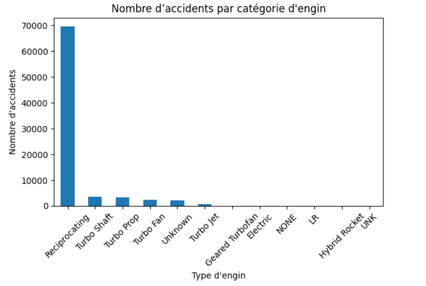
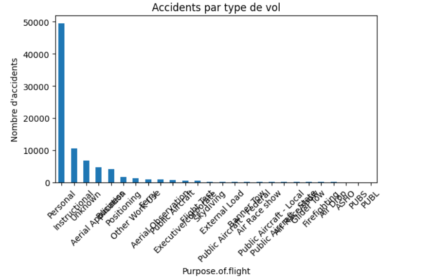
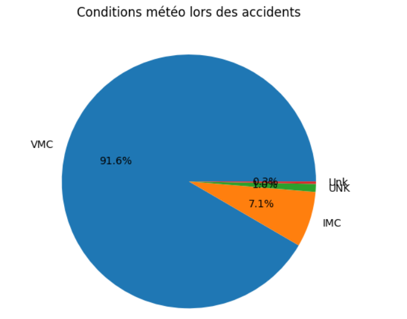
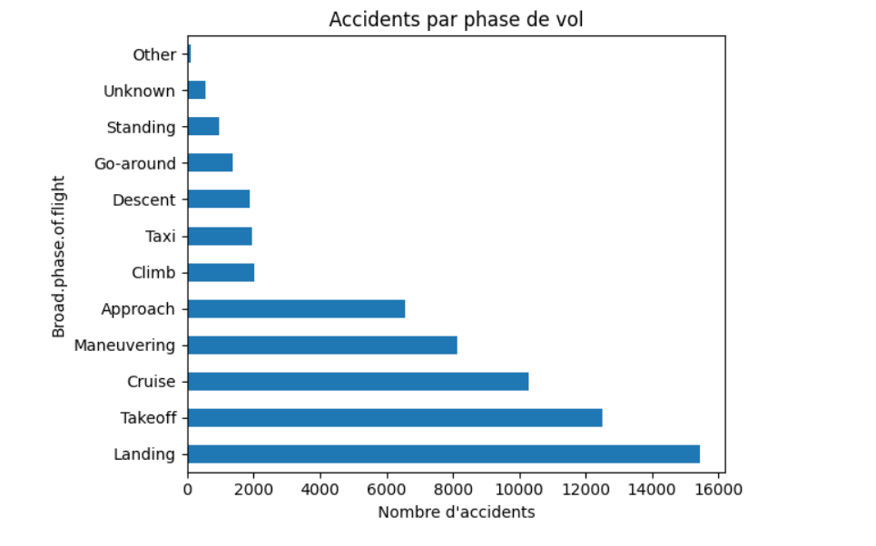

# 

# Predicting Heart Disease
## Overview
For this project, We will use data analysisvisual,ization to generate insights and we will devlop a model that can determine if we can class people with absence or presence of heart disease.

The database is from UC Irvine Machine Learning Repository. The project is built upon an anonymized dataset containing various health and cardiovascular statistics, complemented by authoritative context from resources like the Centers for Disease Control and Prevention (CDC)

## Business Understanding
This project based on the critical issue of heart disease, which is the number one cause of death globally. In the U.S. the condition is responsible for approximately 610,000 deaths annually—equating to 1 in every 4 fatalities—Stroke is the leading cause of death in Haiti, and the country ranks seventh in the world for the total number of strokes per capita*. Given that Coronary Heart Disease alone kills over 370,000 people yearly, the failure to reliably detect and predict these conditions leads directly to poor patient outcomes and escalating healthcare costs. Therefore, the project's primary goal is to leverage statistical modeling and machine learning on a publicly available, anonymized dataset to develop a reliable, data-driven prediction system

The stakeholders(doctors, Manager of a hospital) of this project ask to create a high-confidence predictive model to drive improvements across clinical and public health domains. The model's value proposition is threefold: it will improve diagnostic accuracy by providing early, reliable indicators of cardiovascular risk, enabling healthcare providers to intervene sooner; it will optimize research by providing a robust prediction system that helps researchers better target prevention programs and clinical trials; and finally, the insights gained will facilitate healthy living by translating data-driven risk factors into actionable public health recommendations.

## Data Understanding
The dataset contains 14 variables

Attribute Information:
  -- 1. age     
  -- 2. sex       
  -- 3. chest pain type  (4 values)       
  -- 4. resting blood pressure  
  -- 5. serum cholestoral in mg/dl    
  -- 6. fasting blood sugar > 120 mg/dl       
  -- 7. resting electrocardiographic results  (values 0,1,2) 
  -- 8. maximum heart rate achieved  
  -- 9. exercise induced angina    
  -- 10. oldpeak = ST depression induced by exercise relative to rest   
  -- 11. the slope of the peak exercise ST segment     
  -- 12. number of major vessels (0-3) colored by flourosopy        
  -- 13.  thal: 3 = normal; 6 = fixed defect; 7 = reversable defect 
Target
  -- Heart-Disease

## Analysis and Results/Recommendations
First of all, we ensured the existence of missing data and a visual representation of the first 10 rows of the database (Table 1). It should be noted, however, that treatments were applied to the target variable by converting the absence of diseases to 0 and the presence of a disease to 1.

Recommendations 
1. Implement awareness programs on nutritional prevention and lifestyle habits

The visibility of coronary arteries can be affected by individuals' consumption and lifestyle habits. A diet high in salt and fat, along with a lack of physical activity, can increase the development of atherosclerosis.Therefore, by launching community education programs on heart-healthy nutrition (local consumption: fruits, vegetables, reducing salt and fried foods) and physical activity, we will reduce the prevalence of risk factors, and consequently, the number of cases detected late.

2. Strengthening low-cost community screening

Data show that several simple factors (blood pressure, cholesterol, heart rate, age) are good early indicators. Implement local mobile screening campaigns to measure these basic parameters for free or at low cost. This will help detect at-risk individuals early in rural areas where hospitals are scarce.

3. Create a national database of cardiovascular diseasesThe lack of local data limits public policies.

The creation of a national data collection system (ages, blood pressure, cholesterol) in hospitals and community centers will help us adjust interventions, train better Haitian predictive models, and direct funding to the most affected areas.

## Conlusion and Next Steps
This project achieved its objective of developing a predictive model for the presence or absence of heart disease in individuals, with the aim of assisting primary care centers and reducing deaths related to cardiovascular diseases. The evaluation results showed that Logistic Regression outperforms Random Forest on all key metrics. The Logistic Regression model reached an Accuracy of 90% and an AUC ROC score of 0.9364, demonstrating its superior ability to distinguish between classes. More importantly for a health-related issue, its Recall for Class 1 (disease) is 94%, indicating excellent performance in correctly identifying disease cases. Consequently, the Logistic Regression model was selected for predicting the heart-disease variable.
## Repo Structure
